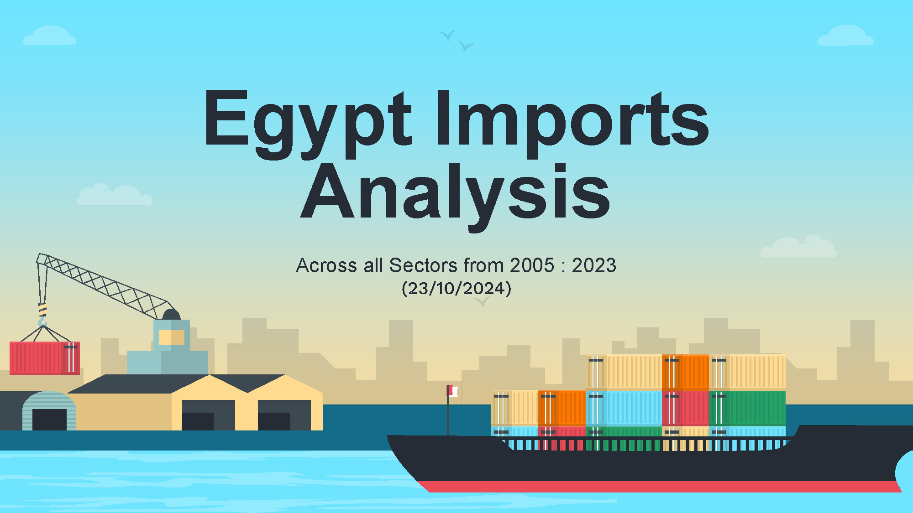

# Egypt Imports Analysis from 2005 : 2023

## **Introduction**  
This report analyzes Egypt’s import data (2005–2023) from the Central Bank of Egypt to assess economic performance, forecast trends, and provide actionable insights for policymakers and businesses. The study covers sectoral dynamics, geographical sources, manufacturing stages, and predictive trends using tools like Excel, SQL, Power BI, and machine learning.  

---

## **Executive Summary**  
### **Summary of Findings**  
- Total imports surged **170%** (2005–2023), peaking at **$87.3B** in 2021.  
- Key sectors: **Oil merchandise (17%)**, chemicals, and base metals.  
- Global crises (2008, COVID-19) caused significant import fluctuations.  

### **Key Findings**  
| Metric                          | Value/Insight                                                                 |  
|---------------------------------|-------------------------------------------------------------------------------|  
| **Total Imports (2005–2023)**   | $28.66B → $77.52B                                                             |  
| **Top 2023 Partners**           | USA, China, Germany (**42%** of total imports)                                |  
| **Crisis Impacts**              | - 2008: -2.68% in 2009 - COVID-19: +23.42% in 2021                        |  
| **2022 Declines**               | Vehicles (-$2.68B), Base Metals (-$1.89B), Chemicals (-$1.81B)                |  
| **Oil Predictions**             | 2023: $11.62B ▼ 2024: $12.41B ▲ 2025: $10.87B ▼                         |  

---

## **Data Overview**  
### **Sources & Scope**  
- **Data Source**: Central Bank of Egypt (2005–2022 trade data).  
- **Variables**: Product, sector, year, import/export values, regions, manufacturing stages.  
- **Scope**: 37 products, 8 sectors, 7 manufacturing stages.  

### **Data Preparation**  
- Merged and cleaned two Excel datasets.  
- Normalized tables for geographical regions and manufacturing stages.  
- Handled missing values and standardized formats.  

---

## **Exploratory Analysis**  
### **Key Insights**  
1. **Growth Trends**:  
   - **Peak Growth**: +23.42% (2021).  
   - **Sharp Decline**: -18.92% (2022).  
2. **Regional Contributions (2022)**:  
   - Asia (24.25%), EU (21.02%), Arab countries (20.45%).  
3. **Sectoral Distribution**:  
   - Oil merchandise peaked at $12.49B (2017).  
   - Raw materials accounted for **20–24%** of total imports.  

---

## **Results**  
### **Sectoral Trends**  
- **Oil Dependency**: Dominated imports but projected to decline by 2025.  
- **Intermediate Goods**: Peaked at $6.64B (2021).  
- **Consumer Non-Durables**: Steady growth to $12.15B (2021).  

### **Predictive Insights**  
- **Oil Forecast**: Volatility-driven decline predicted using machine learning models.  

---

## **Discussion**  
### **Strengths & Weaknesses**  
- **Strengths**: Growth in consumer goods and diversified regional partnerships.  
- **Weaknesses**: Over-reliance on oil and raw materials.  
- **Opportunities**: Renewable energy adoption, value-added agriculture.  

### **Limitations**  
- Short data span (18 years) affected long-term forecasting accuracy.  
- External factors (e.g., geopolitical shifts) were not modeled.  

---

## **Recommendations**  
### **Strategic Actions**  
1. **Promoting Domestic Production**  
    - Offer tax breaks for key imports (food, pharma, manufacturing).  
    - Simplify regulations and improve financing access.  
    - Fund R&D to boost local innovation.  

2. **Power Sector Development**  
    - Shift to renewables (solar/wind).  
    - Boost natural gas for cleaner power.  
    - Expand EV infrastructure and public transport.  

3. **Agricultural Development**  
    - Adopt precision farming & sustainable methods.  
    - Upgrade irrigation for water-scarce regions.  
    - Develop food processing & packaging industries.  

4. **Industrial Development**  
    - Attract FDI via tax incentives & infrastructure.  
    - Build industrial clusters for collaboration.  
    - Invest in vocational training for modern industries. 

---

## **Conclusion**  
Egypt’s import trends highlight vulnerabilities in oil dependency but opportunities in sustainable development. Strategic investments in energy diversification, agriculture, and industrial efficiency can strengthen economic resilience.  

## **Thank you!**  

